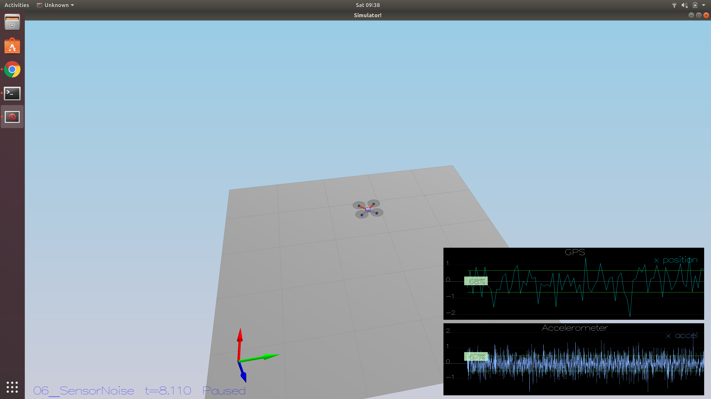
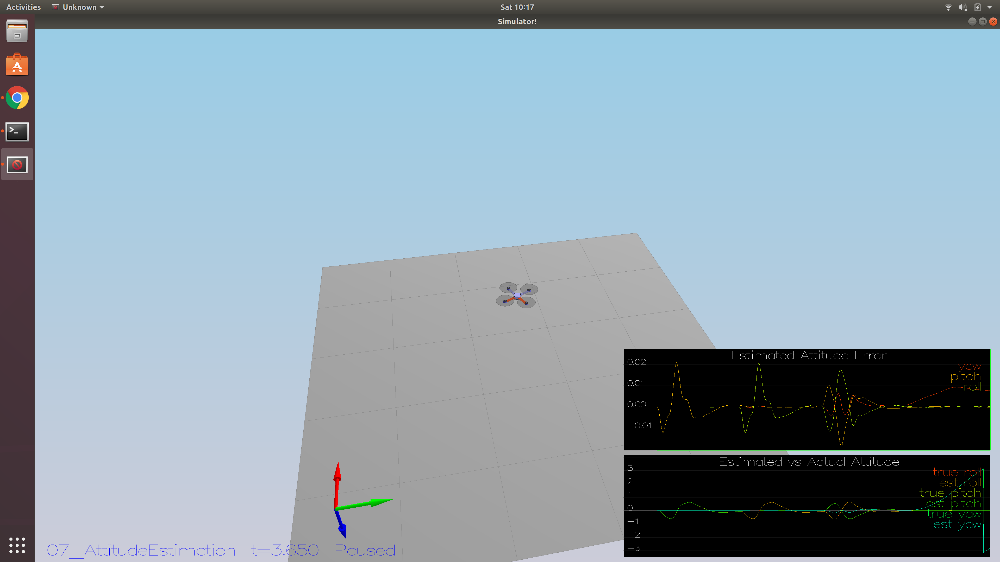
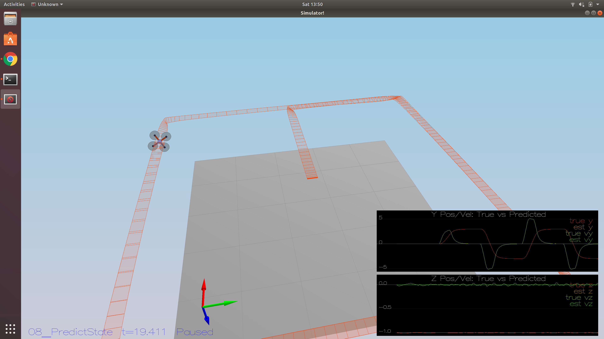
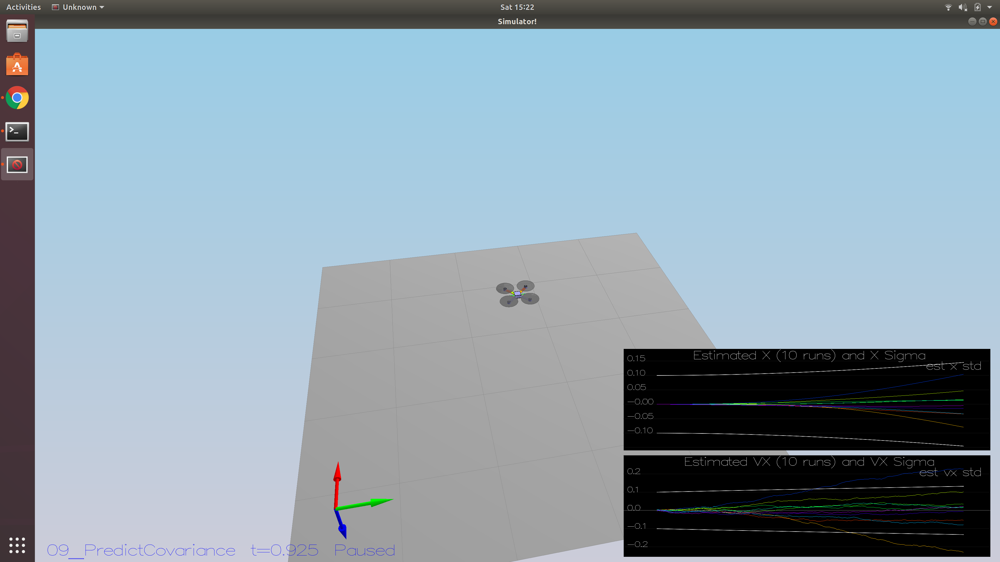
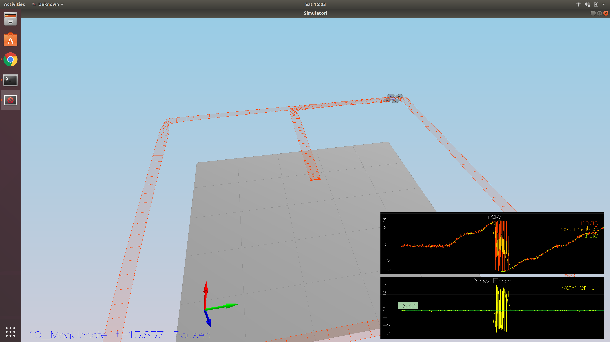

# Building an Estimator

## Writeup
This markdown file explains my approach to completing this project.  It outlines how each point in the rubric was addressed in the subsections below.

## Tasks
### Determine the standard deviation
I wrote a simple python script to compute the statistics for both the GPS and accelerometer X channels:

```python
import numpy as np

if __name__ == "__main__":
    x = []
    with open('./config/log/Graph1.txt', 'r') as f:
        lines = f.readlines()
        for l in lines[1:]:
            s = l.split(',')
            _, p = [float(w) for w in s]  # don't care about time
            x.append(p)
    r = np.array(x)
    m = np.mean(r)
    sig = np.std(r)
    print('GPS: {}, {}'.format(m, sig))

    x = []
    with open('./config/log/Graph2.txt', 'r') as f:
        lines = f.readlines()
        for l in lines[1:]:
            s = l.split(',')
            _, p = [float(w) for w in s]  # don't care about time
            x.append(p)
    r = np.array(x)
    m = np.mean(r)
    sig = np.std(r)
    print('ACC: {}, {}'.format(m, sig))
```

which output the following for a sample run:

``` bash
GPS: -0.09302256603773586, 0.6607258963865655
ACC: -0.017694713615023474, 0.4899061925699823
```

I input rounded values into `config/06_SensorNoise.txt` and scenario `06_SensorNoise` passes, as expected:

<p align="center">

</p>

### Rate Gyro Integration
I chose to integrate using the quaternion method; see Lines 101-111 in `QuadEstimatorEkf.cpp`.  Here's a supporting figure from the simulation to show the method in action:

<p align="center">

</p>

Scenario `07_AttitudeEstimation` passes.

### Implement prediction step
#### Step 1: Show estimated state (with no predict implementation) does not follow the true state

It's clear that the state estimate is very poor without a prediction implementation.  There are no surprises here.

<p align="center">

</p>

Scenario `08_PredictState` isn't Pass/Fail, but the figure above looks pretty bad.

#### Step 2: Show estimated state (with predict implementation) follows the true state with minimal lag
I added my implementation in the `PredictState` method; see Lines 173-180 in `QuadEstimatorEkf.cpp`.

<p align="center">

</p>

Scenario `08_PredictState` results in figure look much better.

#### Step 3: Demonstrate default covariance

The covariance estimate without dynamic update component clearly does not capture the actual growth of errors.

<p align="center">

</p>

Scenario `09_PredictCovariance` shows covariance in plot above does not match sampled trajectory data well.

#### Step 4: Implement covariance model
First, I had to add the calculation of the derivative matrix `RbgPrime`; see Lines 206-215 in `QuadEstimatorEkf.cpp`.  I then added the covariance computation to the `Predict` method in `QuadEstimatorEKF.cpp`; see Lines 260-270 in `QuadEstimatorEkf.cpp`.  Additionally, I changed the `QPosXYStd` to keep the 10 trajectories bounded by the 1-sigma boundary line during the simulation.  The initial covariance appears to be really high, so I eye-balled the slope of the 1-sigma line and tried to match it to the rate of growth of the worst performers in the 10 trajectories.  I also changed and `QVelXYStd` values to get the 1-sigma bound to be larger than ~7 of the observed 10 trajectories. 

<p align="center">

</p>

Scenario `09_PredictCovariance` shows covariance does matches sampled trajectory data much better than previously.

### Implement magnetometer update
See Lines 317-325 in `QuadEstimatorEkf.cpp`.  After adding the measurement model to the update, the scenario fails because it looks like `QYawStd` is too small.  I changed the value to 0.12, which is a factor of 2.5 larger than the default value.

<p align="center">

</p>

Now the value is sufficient for the test to pass both the error and covariance tests to pass for Scenario `10_MagUpdate`.

### Implement the GPS update
See Lines 294-296 in `QuadEstimatorEkf.cpp`.  No changes to the noise levels needed to pass Scenario `11_GPSUpdate`.

<p align="center">

</p>

## Flight Evaluation
I added my controller \( implementation and gains \) from the previous project and ran the simulator with the `11_GPSUpdate` test case to see if I needed to de-tune the controller gains.

<p align="center">

</p>

Apparently, the gains selected were good enough to compensate for the estimator noise and errors without further tuning.  The z position error is starting to drift by the end of the run, but the total error still passes, so I will leave the gains as-is.
